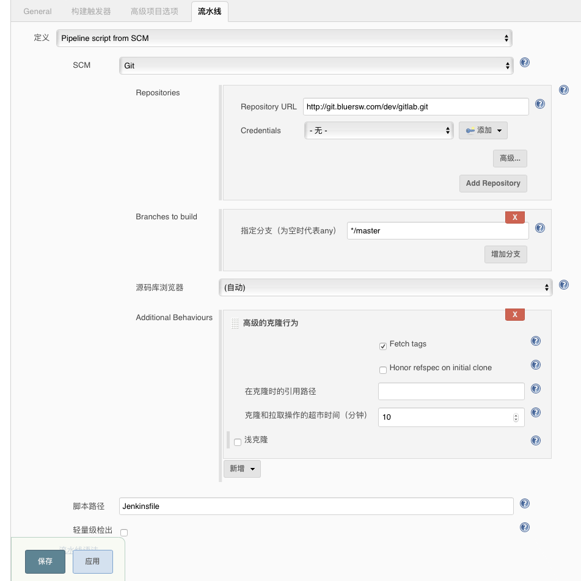

# Jenkins Json Build

此项目是依靠Jenkins共享类库（Shared Libraries）机制，使用JSON配置文件驱动构建过程，以便于剥离Jenkinsfile脚本的的编写和抽象复用Jenkins构建的执行过程。

## 内容列表

1. [准备工作](#准备工作)
1. [创建Jenkins流水线任务](#创建Jenkins流水线任务)
1. [Json文档格式及运行方式](#json文档格式及运行方式)
1. [Json中的变量](#json中的变量)

## 准备工作

1. [安装Jenkins](https://github.com/sunweisheng/Jenkins/blob/master/Install-Jenkins.md)
1. [了解Jenkins共享类库](https://www.jenkins.io/doc/book/pipeline/shared-libraries/)
1. [安装 Gitlab](https://github.com/sunweisheng/Kvm/blob/master/Install-Gitlab.md)
1. [了解共享类库项目构成](https://github.com/sunweisheng/Jenkins/blob/master/Global-Shared-Library.md)【非必须】

## 创建Jenkins流水线任务

### 新建流水线

在Jenkins系统中新建一个流水线任务：

任务配置中将定义修改为pipeline script from SCM，SCM修改为Git，Repository URL修改为项目仓库地址，取消最下面的轻量级检出复选框（因为以后会和Git Parameter插件冲突），Additional Behaviours中选择高级的克隆行为，将克隆和拉取操作的超市时间（分钟）设定为10分钟（因为有的项目比较大首次克隆会比较慢）：

最后保存退出。

### 项目目录中需要的文件

项目目录下需要存在两个文件，Jenkinsfile和jenkins-project.json，可以从[示例文件](https://github.com/sunweisheng/jenkins-json-build/tree/master/example/json-structure)获得，其中Jenkinsfile是Jenkins克隆项目之后执行构建脚本的文件，jenkins-project.json是本项目需要的构建配置文件。

### 配置共享类库

在系统配置中需要对共享类库进行设置，共享类库设置如下：shared-library是共享类库的名字，以后在构建脚本中会用到，项目仓库中是共享类库的仓库地址。

将本项中shared-library目录下的resources、src、vars三个目录（[浏览链接](https://github.com/sunweisheng/jenkins-json-build/tree/master/shared-library)）拷贝到共享类库的仓库中。

### 运行流水线任务

新建流水线任务完成后，点击立即构建，完成构建过程：


## Json文档格式及运行方式

上述示例中的初始化、代码检查、单元测试、编译构建、部署五个构建过程是在Jenkinsfile中定义：

```groovy
@Library('shared-library') _

pipeline {
	agent any
	stages {
		stage('初始化') {
			steps {
				script{
					runWrapper.loadJSON('/jenkins-project.json')
					runWrapper.runSteps('初始化')
				}
			}
		}
		stage('代码检查') {
			steps {
				script{
					runWrapper.runSteps('代码检查')
				}
			}
		}
		stage('单元测试') {
			steps {
				script{
					runWrapper.runSteps('单元测试')
				}
			}
		}
		stage('编译构建') {
			steps {
				script{
					runWrapper.runSteps('编译构建')
				}
			}
		}
		stage('部署') {
			steps {
				script{
					runWrapper.runSteps('部署')
				}
			}
		}
	}
}
```

具体构建时执行的步骤是在项目仓库根目录下的jenkins-project.json文件中定义：

```json
{
  "初始化": {
    "执行脚本": {
      "Type": "COMMAND_STDOUT",
      "Script": {
        "脚本-1": "echo 初始化脚本-1",
        "脚本-2": "echo 初始化脚本-2"
      }
    }
  },
  "代码检查": {
    "执行脚本": {
      "Type": "COMMAND_STATUS",
      "Script": {
        "脚本-1": "echo 代码检查脚本-1",
        "脚本-2": "echo 代码检查脚本-2"
      }
    }
  },
  "单元测试": {
    "执行脚本": {
      "Type": "COMMAND_STATUS",
      "Script": {
        "脚本-1": "echo 单元测试脚本-1",
        "脚本-2": "echo 单元测试脚本-2"
      }
    }
  },
  "编译构建": {
    "执行脚本": {
      "Type": "COMMAND_STATUS",
      "Script": {
        "脚本-1": "echo 编译构建脚本-1",
        "脚本-2": "echo 编译构建脚本-2"
      }
    }
  },
  "部署": {
    "执行脚本": {
      "Type": "COMMAND_STATUS_FOR",
      "For": "1,2,3",
      "ScriptTemplate": "echo 编译构建脚本-${loop-command-for}"
    }
  }
}
```

定义构建具体步骤的json配置文件中节点名字大多数情况下可以随意定义（除GlobalVariable节点和RuntimeVariable节点），重点是第一层节点代表要执行构建步骤的步骤集合，上述示例中第一层节点对应着Jenkinsfile文件中定义构建构成的stage，然后使用runWrapper.runSteps()方法执行对应的构建步骤序列，这个执行构建步骤的集合在本项目中叫Steps。

在Steps中可以定义一个或多个需要执行的具体构建步骤，这些具体的构建步骤在本项目中叫Step，每一个Step节点内需要有一个Type节点来声明执行步骤的类型，共享类库通过Type识别该步骤采取何种方式进行执行，上述出现的三个Type是：

* COMMAND_STDOUT：执行命令行脚本并输出脚本的标准输出内容
* COMMAND_STATUS：执行命令行脚本并输出脚本的返回值0代表成功，非0代表失败
* COMMAND_STATUS_FOR：循环创建需要执行的脚本然后用COMMAND_STATUS方式执行

查看构建日志：

```text
开始执行[/root/.jenkins/workspace/Test-Jenkins-Json-Build/jenkins-project.json]的[初始化]
开始执行[初始化]的[执行脚本]
开始执行[脚本-1]的[echo 初始化脚本-1]命令
bash: no job control in this shell
执行完成[初始化脚本-1]
开始执行[脚本-2]的[echo 初始化脚本-2]命令
bash: no job control in this shell
执行完成[初始化脚本-2]
执行[执行脚本]完成
执行[初始化]完成
开始执行[/root/.jenkins/workspace/Test-Jenkins-Json-Build/jenkins-project.json]的[代码检查]
开始执行[代码检查]的[执行脚本]
开始执行[脚本-1]的[echo 代码检查脚本-1]命令
bash: no job control in this shell
代码检查脚本-1
执行完成[0]
开始执行[脚本-2]的[echo 代码检查脚本-2]命令
bash: no job control in this shell
代码检查脚本-2
执行完成[0]
执行[执行脚本]完成
执行[代码检查]完成
开始执行[/root/.jenkins/workspace/Test-Jenkins-Json-Build/jenkins-project.json]的[单元测试]
[Pipeline] echo
开始执行[单元测试]的[执行脚本]
开始执行[脚本-1]的[echo 单元测试脚本-1]命令
bash: no job control in this shell
单元测试脚本-1
执行完成[0]
开始执行[脚本-2]的[echo 单元测试脚本-2]命令
bash: no job control in this shell
单元测试脚本-2
执行完成[0]
执行[执行脚本]完成
执行[单元测试]完成
开始执行[/root/.jenkins/workspace/Test-Jenkins-Json-Build/jenkins-project.json]的[编译构建]
开始执行[编译构建]的[执行脚本]
开始执行[脚本-1]的[echo 编译构建脚本-1]命令
bash: no job control in this shell
编译构建脚本-1
执行完成[0]
开始执行[脚本-2]的[echo 编译构建脚本-2]命令
bash: no job control in this shell
编译构建脚本-2
执行完成[0]
执行[执行脚本]完成
执行[编译构建]完成
开始执行[/root/.jenkins/workspace/Test-Jenkins-Json-Build/jenkins-project.json]的[部署]
开始执行[部署]的[执行脚本]
开始执行[For-1]的[echo 编译构建脚本-1]命令
bash: no job control in this shell
编译构建脚本-1
执行完成[0]
开始执行[For-2]的[echo 编译构建脚本-2]命令
bash: no job control in this shell
编译构建脚本-2
执行完成[0]
开始执行[For-3]的[echo 编译构建脚本-3]命令
bash: no job control in this shell
编译构建脚本-3
执行完成[0]
执行[执行脚本]完成
执行[部署]完成
Finished: SUCCESS
```

从日志中可以看出构建步骤的执行是按照jenkins-project.json的节点定义进行的，这样就可以统一和标准化Jenkinsfile内的脚本，并用每个项目内的jenkins-project.json文件来定义不同的项目构建步骤，也可以让开发人员不必关心如何编写Jenkins构建脚本，只定义构建的json配置文件即可完成构建工作，对于拥有众多项目或开发人员比较多的组织能起到很好的帮助作用。

因为在执行脚本前都添加了#!/bin/bash -il命令，目的是加载/etc/profile定义的环境变量，所以每个命令脚本执行时都会有一个bash: no job control in this shell提示，这个问题还没有解决如果你知道请告诉我。

## json中的变量

为了方便在json中方便的配置构建步骤，本项目允许在json中定义变量并使用变量简化配置内容。变量的作用域程序编写一致：就近原则，GlobalVariable节点定义的变量作用域是整个文档，但在每个节点可以用Variable定义局部变量，如果Variable变量名称和GlobalVariable定义的变量名称相同则会覆盖GlobalVariable变量的值（就近原则），并且Variable定义的局部变量离开定义的节点则无效，另外定义变量和使用变量有先后顺序，如果在使用之前文档没有定义该变量则变量无效，在定义变量之后使用变量才是正确的。

```json
//定义变量
//在GlobalVariable节点或Variable节点内
"变量名": "变量值"

//使用变量
//在定义变量之后任何节点的内容中都可以引用变量
"节点名称": "${变量名称}"
```

在文档中可使用Jenkins的env全局变量，比如BUILD_NUMBER、JOB_NAME、JENKINS_URL等，也可以在运行时使用json配置文件中的RuntimeVariable节点定义的内容创建自己的全局变量，还可以直接用GlobalVariable和Variable节点直接在文档中定义全局和局部变量，上述变量加载的顺序是：Jenkins的env全局变量（含构建参数变量）、RuntimeVariable节点定义的变量、GlobalVariable节点定义的变量、Variable节点定义的变量，按照上述变量加载顺序，变量加载后就能使用，其中Jenkins的env全局变量和RuntimeVariable节点定义的变量都会隐式的加载到GlobalVariable定义的全局变量中，而且是优先其他变量被加载，以下是定义变量和使用变量的示例([示例文件](https://github.com/sunweisheng/jenkins-json-build/tree/master/example/json-variable))：

Jenkinsfile文件内容：

```groovy
@Library('shared-library') _

pipeline {
	parameters { //定义构建参数
        choice choices: ['部署全部'], description: '请选择要部署的项目', name: 'Deploy_Choice'
    }
	agent any
	stages {
		stage('输出变量值') {
			steps {
				script{
					runWrapper.loadJSON('/jenkins-project.json')
					runWrapper.runSteps('测试变量')
				}
			}
		}
	}
}
```

jenkins-project.json文件内容:

```json
{
  "RuntimeVariable": {
    //Deploy_Choice是构建参数
    "JENKINS_PARAMS_DEPLOY": "echo ${Deploy_Choice}",
    //BUILD_URL是Jenkins的env全局变量
    "JENKINS_BUILD_URL": "echo ${BUILD_URL}",
    //会执行pwd命令获取当前目录
    "SCRIPT_PWD": "pwd",
    //执行脚本获取git commit的信息
    "SCM_CHANGE_TITLE": "git --no-pager show -s --format=\"%s\" -n 1"
  },
  "GlobalVariable": {
    //使用RuntimeVariable的JENKINS_PARAMS_DEPLOY变量值
    "GV_PARAMS_DEPLOY": "${JENKINS_PARAMS_DEPLOY}",
    //使用RuntimeVariable的JENKINS_BUILD_URL变量值
    "GV_BUILD_URL": "${JENKINS_BUILD_URL}",
    //定义一个全局的健值对变量
    "GV_VAR": "gv_var_value",
    //定义一个全局的健值对变量
    "TEMP_VAR": "temp_var_value"
  },
  "测试变量": {
    "输出RuntimeVariable变量脚本": {
      "Type": "COMMAND_STATUS",
      "Script": {
        "输出JENKINS_PARAMS_DEPLOY": "echo ${JENKINS_PARAMS_DEPLOY}",
        "输出JENKINS_BUILD_URL": "echo ${JENKINS_BUILD_URL}",
        "输出SCRIPT_PWD": "echo ${SCRIPT_PWD}",
        "输出SCM_CHANGE_TITLE": "echo ${SCM_CHANGE_TITLE}"
      }
    },
    "输出GlobalVariable变量脚本": {
      "Type": "COMMAND_STATUS",
      "Variable": {
        //覆盖GlobalVariable的TEMP_VAR变量值
        "TEMP_VAR": "variable_value",
        //定义一个局部变量
        "Local_Variable": "Local_Variable"
      },
      "Script": {
        "输出GV_PARAMS_DEPLOY": "echo ${GV_PARAMS_DEPLOY}",
        "输出GV_BUILD_URL": "echo ${GV_BUILD_URL}",
        "输出GV_VAR": "echo ${GV_VAR}",
        "输出TEMP_VAR": "echo ${TEMP_VAR}",
        "输出Local_Variable": "echo ${Local_Variable}"
      }
    }
  }
}
```

构建日志：

```text
开始执行[测试变量]的[输出RuntimeVariable变量脚本]
开始执行[输出JENKINS_PARAMS_DEPLOY]的[echo 部署全部]命令
bash: no job control in this shell
部署全部
执行完成[0]
开始执行[输出JENKINS_BUILD_URL]的[echo http://192.168.0.15:8081/job/Test-Jenkins-Json-Build/11/]命令
bash: no job control in this shell
http://192.168.0.15:8081/job/Test-Jenkins-Json-Build/11/
执行完成[0]
开始执行[输出SCRIPT_PWD]的[echo /root/.jenkins/workspace/Test-Jenkins-Json-Build]命令
bash: no job control in this shell
/root/.jenkins/workspace/Test-Jenkins-Json-Build
执行完成[0]
开始执行[输出SCM_CHANGE_TITLE]的[echo test]命令
bash: no job control in this shell
test
执行完成[0]
执行[输出RuntimeVariable变量脚本]完成

开始执行[测试变量]的[输出GlobalVariable变量脚本]
开始执行[输出GV_PARAMS_DEPLOY]的[echo 部署全部]命令
bash: no job control in this shell
部署全部
执行完成[0]
开始执行[输出GV_BUILD_URL]的[echo http://192.168.0.15:8081/job/Test-Jenkins-Json-Build/11/]命令
bash: no job control in this shell
http://192.168.0.15:8081/job/Test-Jenkins-Json-Build/11/
执行完成[0]
开始执行[输出GV_VAR]的[echo gv_var_value]命令
bash: no job control in this shell
gv_var_value
执行完成[0]
开始执行[输出TEMP_VAR]的[echo variable_value]命令
bash: no job control in this shell
variable_value
执行完成[0]
开始执行[输出Local_Variable]的[echo Local_Variable]命令
bash: no job control in this shell
Local_Variable
执行完成[0]
执行[输出GlobalVariable变量脚本]完成
执行[测试变量]完成
Finished: SUCCESS
```

JENKINS_PARAMS_DEPLOY变量值在执行第二次构建时才能获取到，因为添加构建参数的脚本在Jenkinsfile中，第一次执行时实际上构建任务还没有该构建参数，另外，在RuntimeVariable定义变量是不能和GlobalVariable一样直接用简单的健值对方式赋值，因为在RuntimeVariable定义的变量都需要通过HTTP、读取文件、执行命令脚本这三种方式其中的一种方式获得变量值，但可以用echo命令来进行赋值。
